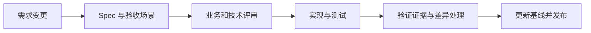

# AnyLine 规范基线

企业部门事务跟踪与团队协作系统 · Specification Baseline

| 文档控制项 | 内容 |
| --- | --- |
| 基线编号 | AL-SPEC-1.0 |
| 文档版本 | 1.0 |
| 编制日期 | 2026-09-07 |
| 状态 | 基线评审稿 |
| 适用范围 | 项目空间、事务与依赖、协作、报表、操作审计及配套交互 |
| 实现参照 | 当前工作区；Git HEAD `2f7d0b8`，包含工作区中的 `audit.py` 和浏览器检查脚本 |
| 评审角色 | 业务负责人、项目空间管理员、研发负责人、测试负责人；具体评审人待指定 |

## 1. 文档目的

本规范定义 AnyLine 当前版本的产品范围、业务约束、技术契约与验收条件，供需求评审、开发维护、测试验收和项目交接共同使用。它将已经形成的产品能力固化为可追踪的版本基线，并作为后续规格驱动开发（SDD）的起点。

本次基线依据现有实现与测试整理；版本号表示文档版本，不表示软件已发布为 v1.0。本版供业务与技术评审，正式批准后归档。后续需求应先形成变更规格，再更新实现和验证证据。

## 2. 阅读导航

| 文档 | 回答的问题 | 主要读者 |
| --- | --- | --- |
| [产品与需求规范](product-spec.md) | 系统解决什么问题，谁能做什么，业务规则是什么 | 业务、产品、项目管理员 |
| [技术设计与数据规范](technical-design.md) | 如何组织系统，如何隔离数据、提交事务和保存快照 | 开发、技术评审、运维 |
| [HTTP 接口契约](api-contract.md) | 接口路径、输入输出、鉴权和失败条件是什么 | 开发、集成、测试 |
| [验收与追踪矩阵](acceptance.md) | 每条核心需求如何验证，已有何种证据，还缺什么 | 测试、验收负责人 |
| [操作审计专项 Spec](features/001-audit.md) | 审计如何记录、查询、隔离、脱敏和保留 | 管理员、开发、测试 |
| [需求变更模板](changes/TEMPLATE.md) | 下一次变更如何从需求进入设计、实现和验收 | 全体项目参与者 |

建议对外评审先阅读产品规范，再按关注点查阅技术、接口和验收文档。审计专项可单独用于审计功能评审。

## 3. 规范用语与编号

- **必须 / 不得（MUST / MUST NOT）**：本基线的强制约束，变更须说明影响并重新验收。
- **应（SHOULD）**：推荐做法；未采用时在变更记录中说明原因。
- **可（MAY）**：可选能力或实现选择。
- **后续候选**：尚未纳入当前交付承诺，不视为已经实现。

需求编号采用 `AL-领域-序号`，例如 `AL-AUD-001`。验收场景采用 `AC-领域-序号`。修订需求时保留原编号；删除需求时标记废弃及替代编号，不复用编号。

“已有测试”表示存在对应测试代码，不等同于完整覆盖全部边界；“已验证”必须注明运行时间、环境和结果。计划中的性能指标、审批和测试不得填写为既成事实。

## 4. 基线范围与解释顺序

本套规范面向本地或受控内网的小团队部署。代码、需求和接口之间出现差异时，应登记差异并确定是修订规范还是修改实现，不能仅以某一侧存在就认定另一侧已通过验收。

业务语义以产品规范为主；协议字段以接口契约为主；审计细节以审计专项为主；验收矩阵只说明验证方式和证据，不扩展业务权限。

本基线包含工作区现有文件，不以 Git HEAD 单独代表全部交付内容。正式归档时应提交所有引用的源文件和测试文件，并将基线对应到实际提交号或发布标签。

## 5. 后续 SDD 工作流

1. 使用变更模板描述用户场景、范围和非目标，引用受影响需求编号。
2. 在修改代码前明确字段、权限、失败条件、兼容策略与验收场景。
3. 根据风险选择评审人；涉及权限、删除、审计和迁移的变更需要明确的数据影响说明。
4. 完成实现后维护需求到代码、测试的对应关系，保留实际运行结果。
5. 产品行为、接口和数据结构同步归档；未决问题明确列出，不以勾选代替验证。

## 6. 修订与评审记录

| 版本 | 日期 | 内容 | 状态 |
| --- | --- | --- | --- |
| 1.0 | 2026-09-07 | 建立产品、技术、接口、验收及审计规范基线 | 待评审 |

正式评审时记录评审人、意见、处理结论和日期；本版未填写未经确认的签署信息。
