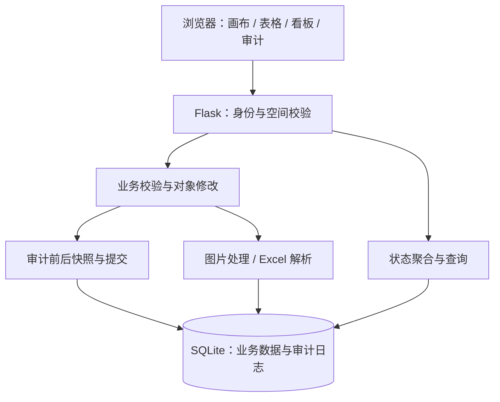
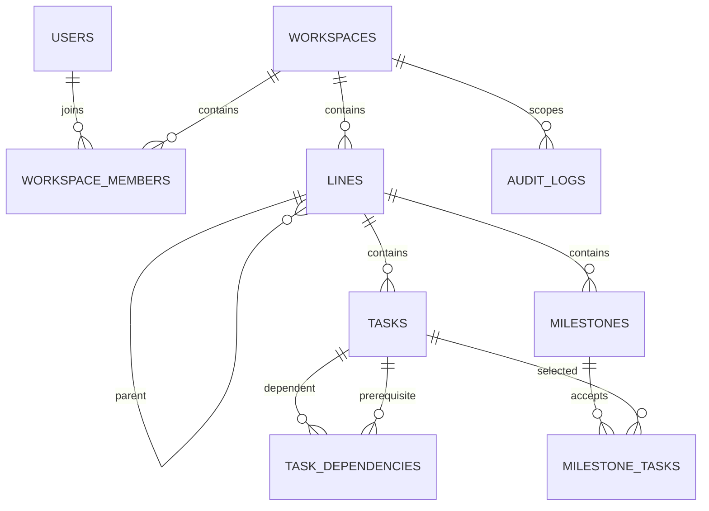

# AnyLine 技术设计与数据规范

文档编号：AL-TDS-001 · 版本：1.0 · 日期：2026-09-07

关联：[产品规范](product-spec.md) · [接口契约](api-contract.md)

## 1. 架构与职责

系统采用同源单页前端、Flask 应用与 SQLite 数据库。浏览器直接加载静态 HTML、CSS、JavaScript，无前端构建步骤；画布使用 SVG。业务接口与静态资源由同一应用提供。

| 组件 | 文件 | 职责 |
| --- | --- | --- |
| HTTP 与业务应用 | [`app.py`](../app.py) | 身份上下文、权限、业务校验、数据访问、迁移、文件与 Excel 接口 |
| 审计模块 | [`audit.py`](../audit.py) | 审计表初始化、快照采集、敏感字段剔除、对象差异记录、事务提交 |
| API 文档 | [`openapi.py`](../openapi.py)、[`static/swagger.html`](../static/swagger.html) | OpenAPI 3 契约、样例和本地 Swagger UI 入口 |
| 页面结构 | [`static/index.html`](../static/index.html) | 登录、工作台、视图、账号菜单、审计页和弹窗容器 |
| 前端逻辑 | [`static/app.js`](../static/app.js) | 状态加载、交互、画布和表格、个人通知、审计查询 |
| 样式 | [`static/style.css`](../static/style.css) | 布局、主题、响应式显示、打印样式 |
| 服务端回归 | [`tests/test_app.py`](../tests/test_app.py) | 临时数据库、HTTP 场景、迁移与部分前端源码断言 |
| 审计浏览器检查 | [`tests/check_audit_ui.cjs`](../tests/check_audit_ui.cjs) | 独立数据库与 Chrome 的真实页面检查 |

## 2. 身份与空间上下文

登录成功后建立 Flask 签名会话，保存用户 ID 与当前空间 ID。Cookie 设置 `HttpOnly` 和 `SameSite=Lax`；会话密钥由 `ANYLINE_SECRET_KEY` 提供。签名会话不应被误认为服务端存储型会话或加密载荷。

`load_authenticated_context` 对受保护 API 加载有效账号和成员空间集合。如果会话中的空间已不可访问，则选择该用户仍可访问的空间；没有任何空间时拒绝业务访问。

普通业务接口使用服务端解析的当前空间，不信任请求体附带的空间 ID。带空间 ID 的管理接口显式校验目标空间管理员权限。归档编辑限制由空间写入端点集合及管理接口校验共同实现。

数据关联的很多约束由应用查询实现，不能仅因为执行了 `PRAGMA foreign_keys=ON` 就认为所有关系均有数据库外键强制保护。绕过应用直接修改 SQLite 不属于受支持的业务编辑方式。

## 3. 核心数据模型

下图表示逻辑关联，不代表每条边都有物理外键。

### 3.1 对象与字段约定

| 实体 / 表 | 关键字段 | 约束与用途 |
| --- | --- | --- |
| `users` | `id, username, display_name, password_hash, managed_by, active` | 账号唯一，用户名使用 NOCASE 比较；姓名不是唯一业务键；头像二进制和元数据存于账号表 |
| `workspaces` | `id, name, description, created_by, archived_at` | 项目空间；归档日期为空表示未归档 |
| `workspace_members` | `workspace_id, user_id, role, joined_at` | 空间与用户联合主键；角色为 admin/member |
| `lines` | `id, workspace_id, parent_id, name, description, color, fork_date, merge_date` | 父线为空表示主线；颜色可为空；修改接口不支持任意重挂父线 |
| `tasks` | `id, workspace_id, line_id, name, content, goal, owner, owners, priority, next_action, risk_reason, status, start_date, end_date, status_since` | `owners` 以有序 JSON 数组保存一个或多个成员姓名；前端标签的勾选及拖拽顺序原样写入，`owner` 保留首位责任人以兼容旧数据和旧客户端 |
| `task_dependencies` | `workspace_id, dependent_task_id, prerequisite_task_id` | 联合主键，禁止自依赖；有效对象、循环与闭环条件由应用校验 |
| `milestones` | `id, workspace_id, line_id, name, target_description, milestone_date` | 归属线固定，验收关系单独存储 |
| `milestone_tasks` | `workspace_id, milestone_id, task_id` | 同空间里程碑与验收事务关联 |
| `task_images` | `id, workspace_id, task_id, mime_type, data, created_at` | 图片二进制保存于数据库 |
| `task_attachments` | `id, workspace_id, task_id, filename, mime_type, data, created_at` | 通用附件，下载时以附件形式响应 |
| `workspace_meta` | `workspace_id, key, value` | 状态名称、颜色及删除批次控制数据；不同键有不同内容语义 |
| `undo_snapshots / redo_snapshots` | `workspace_id, snapshot, created_at` | 每空间各一份，JSON 保存可恢复业务状态 |
| `dashboard_snapshots` | `workspace_id, snapshot_date, total, done, overdue, risk, blocked, status_counts` | 空间与日期联合主键，同日更新聚合值 |
| `dashboard_snapshots.scene / captured_at` | 可空场景 JSON 与 UTC 采集时间 | 启动时补列；状态加载时保存线、事务地图字段、依赖和里程碑。仅保留最近 90 个记录日的场景正文，旧聚合不回填历史。目录与单日场景分开读取 |
| `task_followers / task_comments / task_activities` | 空间、事务、用户或作者、时间和内容 | 协作订阅、评论与业务动态 |
| `notifications` | `workspace_id, user_id, task_id, kind, message, dedupe_key, read_at` | 协作通知；接口和未读数仅纳入指派、提及、评论、状态变化及依赖解除，按空间及用户隔离 |
| `audit_logs` | 见审计专项 | 不依赖可删除业务对象继续存在，保存历史用户账号与对象名称 |

线、事务、里程碑另含 `deleted, del_batch, deleted_at`，用于软删除和批次恢复。业务 ID 为整数；审计 `object_id` 为文本，可表示整数 ID、联合键或配置标识。

### 3.2 时间、大小和数据表示

- 计划日期、状态起始日期及多数业务更新字段使用 `YYYY-MM-DD`；服务端 `date.today()` 决定业务“今日”。
- 审计、评论和通知时间使用带 UTC 标识的时间字符串；审计精确到微秒。前端审计时间按浏览器本地时区显示。
- 日期字段不是完整的修改历史。不能仅凭 `updated_at` 还原一天内的先后顺序。
- 容量单位按 `1024 × 1024` 字节计算，文档称 MiB；界面文案中的 MB 对应当前实现的同一限制。
- Excel 是业务数据交换格式，不承载审计、账号密码、评论、图片、全部配置与恢复历史。

## 4. 写入、审计与失败处理

纳入审计的写请求使用 `audit.Connection`，由请求开始到最终响应阶段控制统一提交。流程如下：

1. 身份与空间检查通过后，执行 `BEGIN IMMEDIATE`，采集操作前快照。
2. 路由执行业务校验、对象变更、必要的业务动态与通知写入。
3. 路由内部的 `commit()` 在审计上下文中延迟实际提交。
4. 响应为 2xx 时采集操作后快照，对每个发生差异的对象写入审计。
5. 审计及业务一次提交；非成功响应或审计写入异常时回滚。

`BEGIN IMMEDIATE` 对写事务进行串行协调。为完整捕获导入、级联、恢复等变更，当前审计采集扫描目标空间对象并计算文件摘要；没有采用逐字段事件总线或增量变更流。大量文件和高频并发写入需另行测量锁等待与快照成本。

读取项目状态会更新日报快照并生成到期通知，读取通知也可能生成到期通知。这些派生维护写入不计为用户编辑审计，不应误描述为所有 GET 都完全无数据库写入。

审计失败不得降级为“业务保存成功但忽略日志”。详见 [审计专项](features/001-audit.md)。

## 5. 软删除与恢复设计

删除业务对象前校验仍有效的外部依赖。级联删除将线及其后代、事务和里程碑设置为同一删除批次。恢复前检查相关父线、前置事务及验收对象是否仍处于其他删除批次，避免恢复后出现断开的有效关系。

单步撤销快照覆盖线、事务、里程碑、验收关系、依赖、图片和附件。评论、关注、通知、成员、状态配置和审计不属于通用撤销快照。恢复业务快照不等于回退整个数据库。

清空回收站会物理删除软删除业务及关联记录，并清除撤销/重做点。空间删除会移除空间业务和成员关系，但审计日志继续保留。审计表的禁止 UPDATE/DELETE 触发器防止应用误改；可管理数据库结构的主体仍可绕过，不能据此宣称具有外部不可抵赖能力。

## 6. 前端状态与交互

| 状态类型 | 保存位置 | 生命周期 |
| --- | --- | --- |
| 当前业务数据、选择、筛选与依赖聚焦 | 页面 `state` 对象 | 加载或切换空间时更新 |
| 视图、缩放、标签及看板周期偏好 | `localStorage` 的 `anyline.prefs` | 同浏览器持久保存，不是服务端账号设置 |
| 日夜主题 | `localStorage` 的 `anyline.theme` | 显式选择优先，支持系统偏好与浏览器 storage 同步 |
| 新建事务草稿 | 页面内存中的 `Map` | 按空间和线隔离；不承诺刷新恢复 |
| 审计筛选与分页 | `auditView` | 查询页会话；切换空间、退出时清理 |
| Swagger UI | 独立 `/api-docs/` 页面 | 读取公开 OpenAPI 定义；调试调用复用当前同源 Cookie 会话 |
| 项目地图分析 | `DashboardAnalysis`，`anyline.analysis.v1.<userId>.<workspaceId>.*` | 独立前端模块；变化确认点、基线与讲解路径存于浏览器，切换上下文时清理内存。打开页面不会移动确认点；回放带请求代次检查并在离开或隐藏页面时停止 |

审计查询和快照详情使用请求序号及空间 ID 检查异步响应，避免旧请求覆盖新空间页面。快照使用文本节点展示 JSON，不将用户数据作为 HTML 注入。

前端不是权限边界。隐藏入口不能替代服务端授权；通过开发者工具直接请求接口仍须受同样的空间与角色约束。

## 7. 设计取舍记录

以下记录说明本次基线采用的设计、代价与重新评估条件，供技术评审确认。

| 编号 | 当前选择 | 理由与代价 | 重新评估触发条件 |
| --- | --- | --- | --- |
| ADR-01 | Flask + SQLite + 原生前端 | 部署链路短，适合小团队；单库写入与全量状态加载存在规模边界 | 大数据量、高并发或多实例需求 |
| ADR-02 | 以空间为业务权限边界 | 便于部门协同；空间成员编辑范围较宽 | 出现细粒度授权、敏感事项隔离需求 |
| ADR-03 | 空间级单步快照恢复 | 可覆盖复杂图结构和文件关系；不是个人操作栈 | 多人交错编辑或多步历史要求 |
| ADR-04 | 审计与业务同库同事务 | 减少漏记和成功状态不一致；写入成本增加 | 外部存证、归档容量或跨系统审计要求 |
| ADR-05 | 文件以数据库 BLOB 保存 | 随数据库一起迁移与备份；快照和体积增长较快 | 附件规模增长、对象存储需求 |
| ADR-06 | 通知采用读取触发与轮询 | 无独立调度服务；用户离线时不主动触达 | 企业 IM、定时摘要或实时推送需求 |

## 8. 部署与运维边界

依赖范围由 [`requirements.txt`](../requirements.txt) 定义：Flask `>=2.2.5,<3.1`、openpyxl `>=3.1,<4`、Pillow `>=10,<12`。应在选定 Python 与依赖组合上安装验证，不把 README 中的宽泛 Python 版本说明当作所有组合的兼容承诺。

| 环境变量 | 用途 |
| --- | --- |
| `ANYLINE_DB_PATH` | 数据库文件路径，缺省为项目中的 `anyline.db` |
| `ANYLINE_SECRET_KEY` | 会话签名密钥，共享环境须设为稳定随机值 |
| `ANYLINE_ADMIN_USERNAME / ANYLINE_ADMIN_PASSWORD` | 初始管理员凭据，仅首次初始化创建账号时使用 |
| `ANYLINE_TEST_CHROME` | 浏览器检查时指定 Chrome 路径 |

应用启动调用 `init_db()`，初始化缺表并补充兼容字段；当前没有独立版本化迁移工具。部署前应备份数据库并验证恢复；避免在多人写入时直接复制数据库文件充当一致性备份，可停服备份或使用 SQLite 在线备份机制。

`python app.py` 使用 Flask 内置服务，默认监听 `0.0.0.0:80`。共享环境应配置适用的 WSGI 服务、反向代理、访问控制与 HTTPS。当前没有独立 CSRF token 流程、登录限流、完整恶意文件扫描、自动备份调度或高可用方案；这些事项应在相应部署范围中另行设计与验收。
